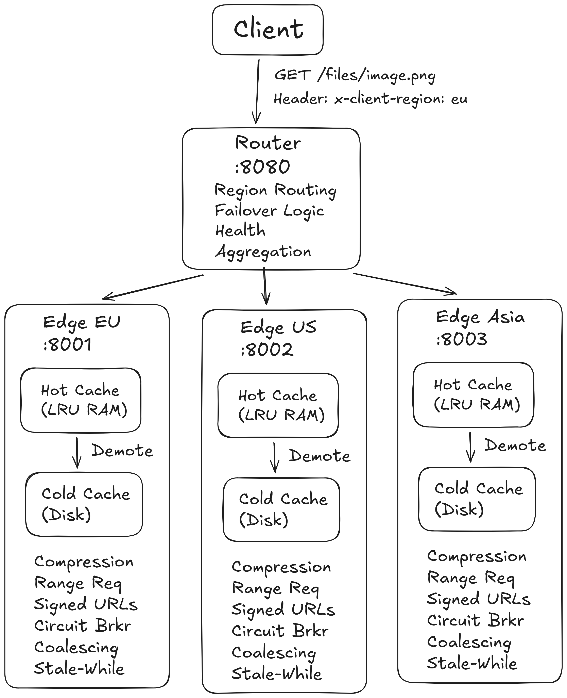
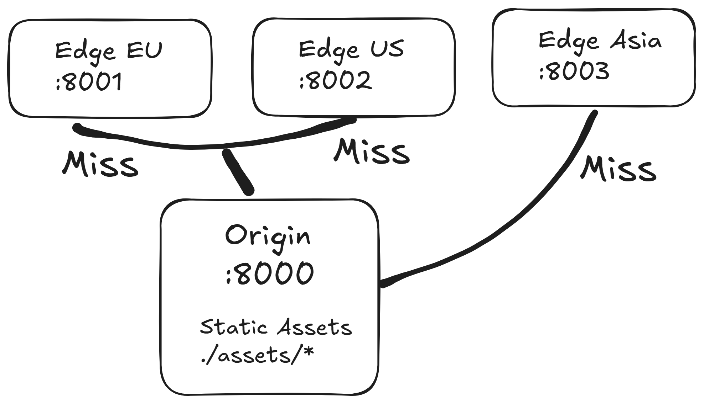
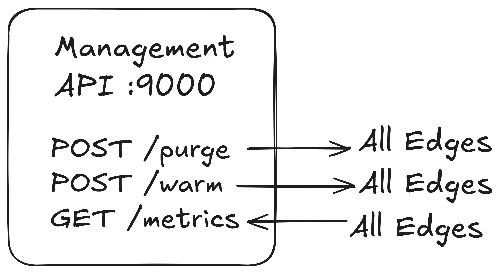
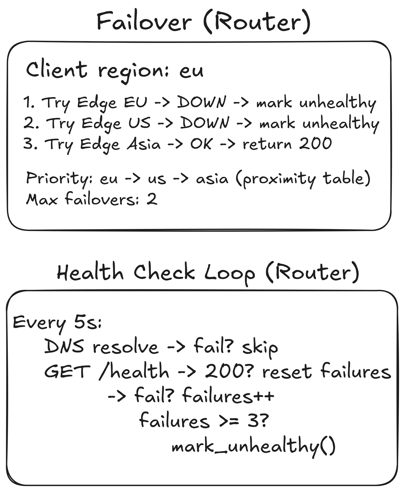

<div align="center">

  

  <br />
  <br />

  
  
  
  

  <br />
  <br />

  <h1>0xCDN</h1>

  <p>
    Production-grade Content Delivery Network simulation.
    <br />
  </p>

  <p>
    Multi-node topology &middot; Tiered caching &middot; Geographic routing &middot; Live metrics
  </p>

</div>

---

<h2>Overview</h2>

<h3>System Architecture</h3>

<div align="center">
  
  <p>
    <em>
      Multi-node CDN topology: origin server, geographically distributed edge caches,
      region-aware router with automatic failover, and management API with live dashboard.
    </em>
  </p>
    
    
    
</div>

<br />

<h3>Functional Showcase</h3>

<div align="center">

<table>
  <tr>
    <td align="center" valign="top" width="33%">
      <video src="https://github.com/user-attachments/assets/PLACEHOLDER_1" autoplay loop muted playsinline width="100%"></video>
      <br />
      <strong>Compose Up</strong>
      <br />
      <sub>
        Full 6-service CDN infrastructure spinning up with a single <code>docker compose up</code>.
      </sub>
    </td>
    <td align="center" valign="top" width="33%">
      <video src="https://github.com/user-attachments/assets/PLACEHOLDER_2" autoplay loop muted playsinline width="100%"></video>
      <br />
      <strong>Cache HIT / MISS</strong>
      <br />
      <sub>
        First request: cache MISS (origin fetch). Second request: cache HIT served from edge in &lt;1ms.
      </sub>
    </td>
    <td align="center" valign="top" width="33%">
      <video src="https://github.com/user-attachments/assets/PLACEHOLDER_2_1" autoplay loop muted playsinline width="100%"></video>
      <br />
      <strong>Response Time</strong>
      <br />
      <sub>
        MISS vs HIT latency comparison via <code>X-Response-Time</code> header - orders of magnitude difference.
      </sub>
    </td>
  </tr>
  <tr>
    <td align="center" valign="top" width="33%">
      <video src="https://github.com/user-attachments/assets/PLACEHOLDER_3" autoplay loop muted playsinline width="100%"></video>
      <br />
      <strong>Geographic Routing</strong>
      <br />
      <sub>
        Requests with <code>X-Client-Region: eu/us/asia</code> routed to nearest edge via proximity table.
      </sub>
    </td>
    <td align="center" valign="top" width="33%">
      <video src="https://github.com/user-attachments/assets/PLACEHOLDER_4" autoplay loop muted playsinline width="100%"></video>
      <br />
      <strong>Cache Purge</strong>
      <br />
      <sub>
        Management API propagates cache invalidation to all edges. Next request returns fresh content.
      </sub>
    </td>
    <td align="center" valign="top" width="33%">
      <video src="https://github.com/user-attachments/assets/PLACEHOLDER_5" autoplay loop muted playsinline width="100%"></video>
      <br />
      <strong>Cache Warm</strong>
      <br />
      <sub>
        Pre-populate all edge caches before user traffic. Zero cold-start latency for first visitors.
      </sub>
    </td>
  </tr>
  <tr>
    <td align="center" valign="top" width="33%">
      <video src="https://github.com/user-attachments/assets/PLACEHOLDER_6" autoplay loop muted playsinline width="100%"></video>
      <br />
      <strong>Range Requests</strong>
      <br />
      <sub>
        HTTP 206 Partial Content - request byte ranges for streaming and resumable downloads.
      </sub>
    </td>
    <td align="center" valign="top" width="33%">
      <video src="https://github.com/user-attachments/assets/PLACEHOLDER_7" autoplay loop muted playsinline width="100%"></video>
      <br />
      <strong>Signed URL Auth</strong>
      <br />
      <sub>
        HMAC-SHA256 token validation at edge level. Invalid or expired tokens → 403 Forbidden.
      </sub>
    </td>
    <td align="center" valign="top" width="33%">
      <video src="https://github.com/user-attachments/assets/PLACEHOLDER_8" autoplay loop muted playsinline width="100%"></video>
      <br />
      <strong>Failover</strong>
      <br />
      <sub>
        Edge nodes stopped → router auto-reroutes via geographic proximity. Health service recovers nodes.
      </sub>
    </td>
  </tr>
  <tr>
    <td align="center" valign="top" width="33%">
      <video src="https://github.com/user-attachments/assets/PLACEHOLDER_9" autoplay loop muted playsinline width="100%"></video>
      <br />
      <strong>Metrics & Health</strong>
      <br />
      <sub>
        Live dashboard with per-edge hit ratio, cache size, and cluster health status.
      </sub>
    </td>
    <td></td>
    <td></td>
  </tr>
</table>

</div>

<h2>Features</h2>

<ul>

  <li>
    <strong>Two-tier cache (hot / cold)</strong><br />
    In-memory LRU for hot data, disk-based JSON storage for cold tier. Automatic demotion on eviction, promotion on access.
  </li>

<h3>Tiered Cache Architecture</h3>

<p>
Cached entries live in two tiers with automatic movement between them:
</p>

<pre>
          ┌─────────────────────────┐
  GET ──▶ │      Hot Tier (LRU)     │ ── HIT ──▶ response
          │  in-memory, O(1) lookup │
          └────────┬────────────────┘
                   │ MISS
                   ▼
          ┌─────────────────────────┐
          │     Cold Tier (Disk)    │ ── HIT ──▶ promote to hot ──▶ response
          │  JSON meta + raw bytes  │
          └────────┬────────────────┘
                   │ MISS
                   ▼
              origin fetch
</pre>

<p>
On hot-tier eviction, entries are <strong>demoted</strong> (not discarded) to cold storage.
On cold-tier hit, entries are <strong>promoted</strong> back to hot tier.
</p>

  <li>
    <strong>Request coalescing (dog-pile prevention)</strong><br />
    When N concurrent requests hit the same uncached key, only one origin fetch occurs. Others wait on an <code>asyncio.Event</code>.
  </li>

  <li>
    <strong>Stale-while-revalidate</strong><br />
    Expired entries are served immediately while a background task refreshes from origin. Users never wait for revalidation. Implements RFC 5861.
  </li>

  <li>
    <strong>Circuit breaker (3-state)</strong><br />
    CLOSED → OPEN → HALF_OPEN. Protects origin from cascading failures with configurable thresholds. Serves stale content when circuit is open.
  </li>

  <li>
    <strong>Region-aware routing with proximity failover</strong><br />
    Deterministic geographic routing via proximity table: <code>eu → [eu, us, asia]</code>. Not random - follows physical distance.
  </li>

  <li>
    <strong>Response compression</strong><br />
    Transparent gzip / deflate / Brotli based on <code>Accept-Encoding</code>. Content-type aware - skips already-compressed formats.
  </li>

  <li>
    <strong>Signed URL authentication (HMAC-SHA256)</strong><br />
    Time-limited, tamper-proof tokens for protected content. Validation at edge - unauthorized requests never reach origin.
  </li>

  <li>
    <strong>Cache-Control parser (RFC 7234)</strong><br />
    Full parsing of <code>max-age</code>, <code>s-maxage</code>, <code>no-cache</code>, <code>no-store</code>, <code>private</code>, <code>stale-while-revalidate</code>, <code>stale-if-error</code>.
  </li>

  <li>
    <strong>HTTP Range requests (RFC 7233)</strong><br />
    Both origin and edge support <code>bytes=</code> ranges. Enables video seeking and resumable downloads.
  </li>

  <li>
    <strong>Graceful shutdown with request draining</strong><br />
    Edges stop accepting new requests on SIGTERM, drain active requests (30s timeout), then clean up.
  </li>

</ul>

<br/>

<h2>Project Modules</h2>

<table>
  <tr>
    <td width="50%" valign="top">
      <h4>Domain</h4>
      <blockquote>Core business entities with zero framework dependencies.</blockquote>
      <table>
        <tr><td><strong>Entities</strong></td><td><code>CacheEntry</code> (content, headers, TTL, SWR window)<br/><code>EdgeNode</code> (id, host, port, region, health)<br/><code>OriginResponse</code> (content, status, headers, ETag)</td></tr>
        <tr><td><strong>Value Objects</strong></td><td><code>CacheKey</code> (method + path + query + Vary hash)<br/><code>ByteRange</code> (RFC 7233 range parsing)</td></tr>
        <tr><td><strong>Ports</strong></td><td><code>CacheStore</code>, <code>OriginClient</code>, <code>MetricsCollector</code> ABCs</td></tr>
      </table>
      <sub>Immutable value objects &middot; Abstract interfaces &middot; No dependencies</sub>
    </td>
    <td width="50%" valign="top">
      <h4>Application</h4>
      <blockquote>Use cases orchestrating domain logic and infrastructure.</blockquote>
      <table>
        <tr><td><code>CacheService</code></td><td>Cache lookup, origin fetch, request coalescing, SWR, range requests</td></tr>
        <tr><td><code>RoutingService</code></td><td>Region-proximity edge selection with ordered failover</td></tr>
        <tr><td><code>HealthService</code></td><td>Background health-check loop with DNS pre-check</td></tr>
        <tr><td><code>MetricsService</code></td><td>Per-edge counters, latency percentiles (p50/p95/p99)</td></tr>
        <tr><td><code>PurgeService</code></td><td>Multi-edge cache invalidation by URL or prefix</td></tr>
        <tr><td><code>WarmService</code></td><td>Multi-edge cache pre-population</td></tr>
      </table>
    </td>
  </tr>
  <tr>
    <td width="50%" valign="top">
      <h4>Infrastructure</h4>
      <blockquote>Concrete implementations of domain ports and cross-cutting concerns.</blockquote>
      <table>
        <tr><td><code>LRUCacheStore</code></td><td>In-memory LRU with byte-level capacity and TTL</td></tr>
        <tr><td><code>TieredCacheStore</code></td><td>Hot/cold tiers with automatic demotion/promotion</td></tr>
        <tr><td><code>HttpOriginClient</code></td><td>HTTP client with exponential backoff retries</td></tr>
        <tr><td><code>ShieldClient</code></td><td>Origin shield (intermediate cache layer)</td></tr>
        <tr><td><code>CircuitBreaker</code></td><td>3-state breaker (closed/open/half-open)</td></tr>
        <tr><td><code>auth</code></td><td>HMAC-SHA256 signed URL generation &amp; validation</td></tr>
        <tr><td><code>compression</code></td><td>gzip / deflate / Brotli with content-type filtering</td></tr>
        <tr><td><code>cache_control</code></td><td>RFC 7234 Cache-Control header parser</td></tr>
        <tr><td><code>logging</code></td><td>Structured JSON logger</td></tr>
      </table>
    </td>
    <td width="50%" valign="top">
      <h4>Presentation</h4>
      <blockquote>FastAPI applications - one image, four roles.</blockquote>
      <table>
        <tr><td><strong>Origin</strong></td><td>File server with ETag, Range, Content-Type detection, directory traversal protection</td></tr>
        <tr><td><strong>Edge</strong></td><td>Caching proxy with compression, signed URLs, graceful shutdown, request/timing middleware</td></tr>
        <tr><td><strong>Router</strong></td><td>Load balancer with region routing, failover, hop-by-hop header filtering</td></tr>
        <tr><td><strong>Management</strong></td><td>Admin API: purge, warm, metrics aggregation, live HTML dashboard</td></tr>
      </table>
      <sub>Single entrypoint &middot; <code>CDN_ROLE</code> env var selects the app</sub>
    </td>
  </tr>
</table>

<br/>

<h2>API Endpoints</h2>

<h3>Origin Server &middot; <code>:8000</code></h3>

| Method | Endpoint | Description |
|:--|:--|:--|
| `GET` | `/files/{path}` | Serve file with ETag + Range support |
| `GET` | `/health` | Health check |

<h3>Edge Node &middot; <code>:8001-8003</code></h3>

| Method | Endpoint | Auth | Description |
|:--|:--|:--|:--|
| `GET` | `/files/{path}` | token (optional) | Serve cached file with compression |
| `GET` | `/health` | — | Edge health status |
| `DELETE` | `/internal/purge` | — | Purge by URL or prefix |
| `GET` | `/internal/stats` | — | Cache store statistics |

<h3>Router &middot; <code>:8080</code></h3>

| Method | Endpoint | Headers | Description |
|:--|:--|:--|:--|
| `GET` | `/files/{path}` | `X-Client-Region` | Proxy to nearest healthy edge |
| `GET` | `/{path}` | `X-Client-Region` | Catch-all proxy |
| `GET` | `/edges` | — | List all edges with health status |
| `GET` | `/health` | — | Router health + edge count |

<h3>Management API &middot; <code>:9000</code></h3>

| Method | Endpoint | Description |
|:--|:--|:--|
| `DELETE` | `/cache?url=...&prefix=...` | Purge cache across all edges |
| `POST` | `/cache/warm` | Pre-warm edges with URL list |
| `GET` | `/metrics` | Aggregated per-edge metrics |
| `GET` | `/dashboard` | Live HTML metrics dashboard |
| `GET` | `/health` | Management health check |

<br/>

<h2>Quick Start</h2>

<blockquote>
Requirements: <strong>Docker</strong>, <strong>Docker Compose</strong>, <strong>Python 3.10+</strong>.
</blockquote>

<h3>1 - Clone & Configure</h3>

```bash
git clone https://github.com/0xd3ny5/0xCDN && cd 0xCDN

cp .env.example .env
# defaults work out of the box
```

<h3>2 - Start Services</h3>

```bash
docker compose up --build -d
```

<table>
  <tr><th>Service</th><th>Port</th><th>Role</th></tr>
  <tr><td><strong>origin</strong></td><td><code>8000</code></td><td>File server (source of truth)</td></tr>
  <tr><td><strong>edge-eu</strong></td><td><code>8001</code></td><td>Edge cache - Europe</td></tr>
  <tr><td><strong>edge-us</strong></td><td><code>8002</code></td><td>Edge cache - US</td></tr>
  <tr><td><strong>edge-asia</strong></td><td><code>8003</code></td><td>Edge cache - Asia</td></tr>
  <tr><td><strong>router</strong></td><td><code>8080</code></td><td>Load balancer</td></tr>
  <tr><td><strong>management</strong></td><td><code>9000</code></td><td>Admin API + dashboard</td></tr>
</table>

<h3>3 - Verify</h3>

```bash
curl http://localhost:8080/files/hello.txt -H "X-Client-Region: eu"
# → Hello from 0xCDN origin!

curl http://localhost:8080/health
# → {"status":"healthy","role":"router","healthy_edges":3,"total_edges":3}
```

Open <code>http://localhost:9000/dashboard</code> - live metrics.

<h3>Local Development (without Docker)</h3>

```bash
python -m venv .venv && source .venv/bin/activate
pip install -e ".[dev]"

# Terminal 1 - Origin
PYTHONPATH=src CDN_ROLE=origin CDN_PORT=8000 python -m entrypoint

# Terminal 2 - Edge
PYTHONPATH=src CDN_ROLE=edge CDN_PORT=8001 CDN_ORIGIN_URL=http://localhost:8000 python -m entrypoint

# Terminal 3 - Router
PYTHONPATH=src CDN_ROLE=router CDN_PORT=8080 CDN_ROUTER_EDGES=edge-1:localhost:8001:eu python -m entrypoint
```

<br/>

<h2>Configuration Reference</h2>

| Variable | Default | Description |
|:--|:--|:--|
| `CDN_ROLE` | `edge` | Component to start: `origin` / `edge` / `router` / `management` |
| `CDN_HOST` | `0.0.0.0` | Bind address |
| `CDN_PORT` | `8000` | Bind port |
| | | |
| `CDN_ASSETS_DIR` | `./assets` | Origin file directory |
| | | |
| `CDN_EDGE_ID` | `edge-1` | Unique edge identifier |
| `CDN_EDGE_REGION` | `eu` | Geographic region code |
| `CDN_ORIGIN_URL` | `http://localhost:8000` | Upstream origin URL |
| `CDN_SHIELD_URL` | — | Optional origin shield URL |
| | | |
| `CDN_CACHE_MAX_SIZE_BYTES` | `104857600` | Max cache size (100 MB) |
| `CDN_CACHE_DEFAULT_TTL` | `3600` | Default TTL in seconds |
| `CDN_CACHE_HOT_TIER_MAX_ITEMS` | `1000` | Hot tier max entries |
| `CDN_CACHE_COLD_TIER_PATH` | `/tmp/cdn_cold` | Cold tier disk path |
| | | |
| `CDN_AUTH_SECRET_KEY` | `change-me-in-production` | HMAC signing secret |
| `CDN_AUTH_TOKEN_TTL` | `3600` | Signed URL token lifetime |
| | | |
| `CDN_ROUTER_EDGES` | — | Edge list: `id:host:port:region,...` |
| `CDN_HEALTH_CHECK_INTERVAL` | `5` | Health check interval (seconds) |
| `CDN_HEALTH_CHECK_TIMEOUT` | `3` | Health check timeout (seconds) |
| `CDN_HEALTH_MAX_FAILURES` | `3` | Failures before marking unhealthy |
| | | |
| `CDN_MGMT_EDGE_URLS` | — | Edge URLs for management API |

<br/>
